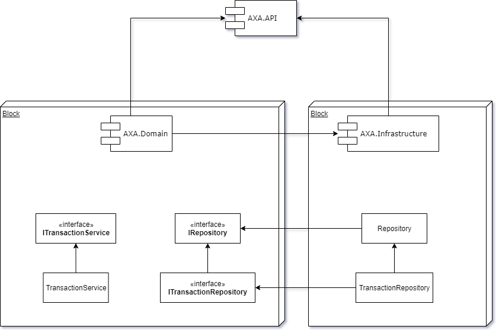

# AXA - .NET Interview Exercise

## Candidate

    
Name: Ruan Guimarães Barcellos

    
E-mail: <a href="mailto:ruan.gbarcellos@gmail.com">ruan.gbarcellos@gmail.com</a>

    

        Links:
        
        
    

## Project Design

    

 

## Adding a get account balance function:
First you will need to:
 - Add a the new function signature to the ITransactionService interface.
 - Add its implementation to the TransactionService service.
 - Add a new function endpoint to the AccountController controller.

Once all functions and signatures has been created, you can now add the logic to the newly created function on the TransactionService.

 

## Positives characteristics of the solution:
 - No extra dependencies (full .NET core)
 - future-proof (by using dependency injection and .net core built in dependency containers, we can easily change any implementation by using its interfaces).
 - Testable
 - easy and simple to use